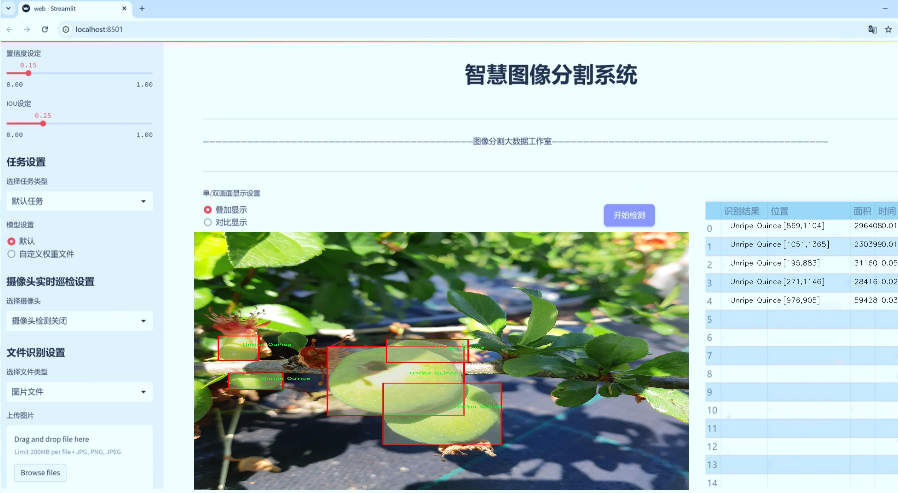
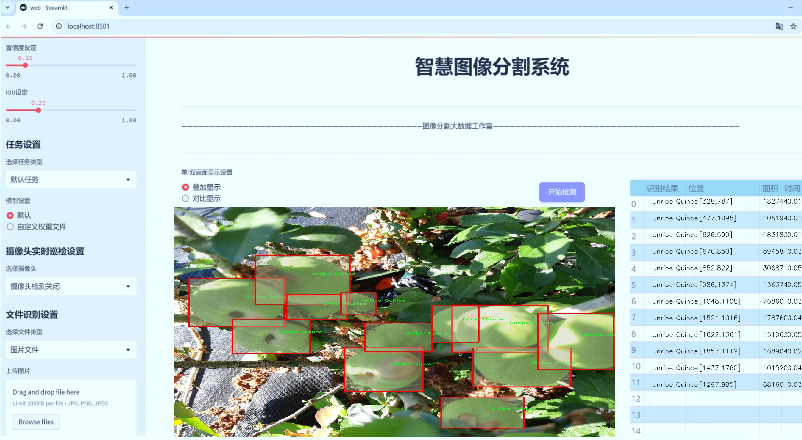
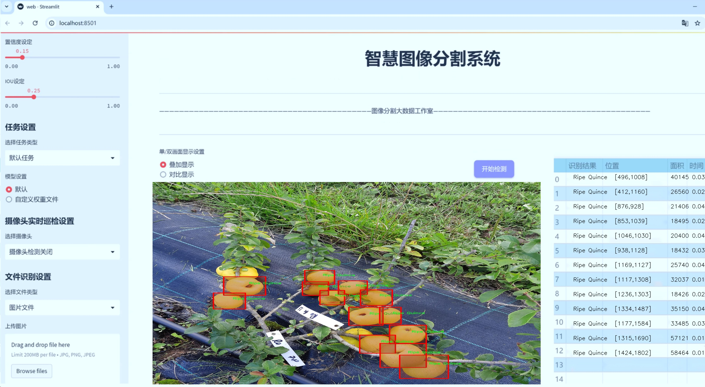
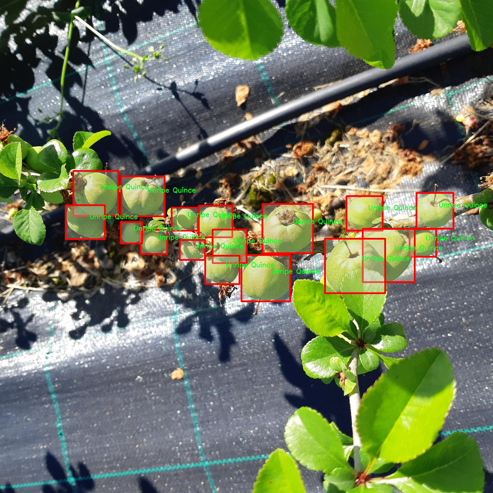
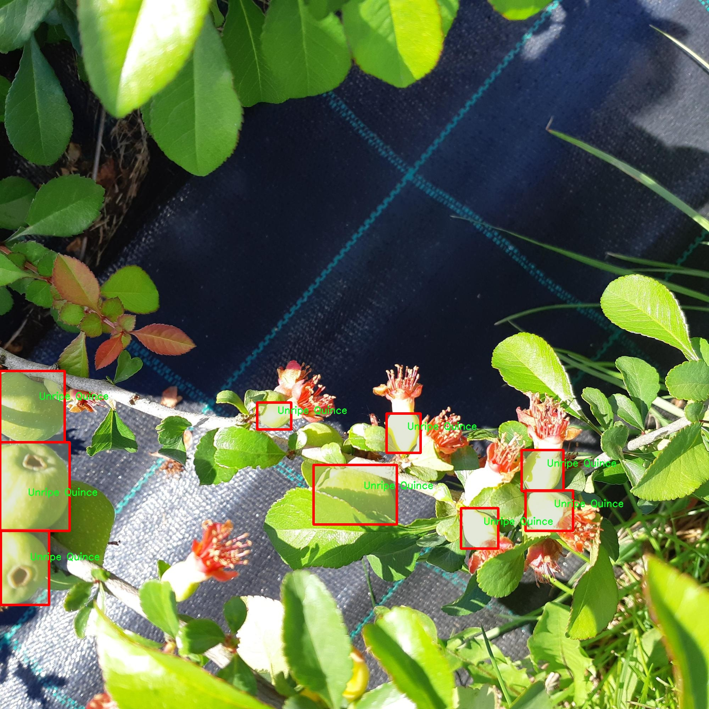
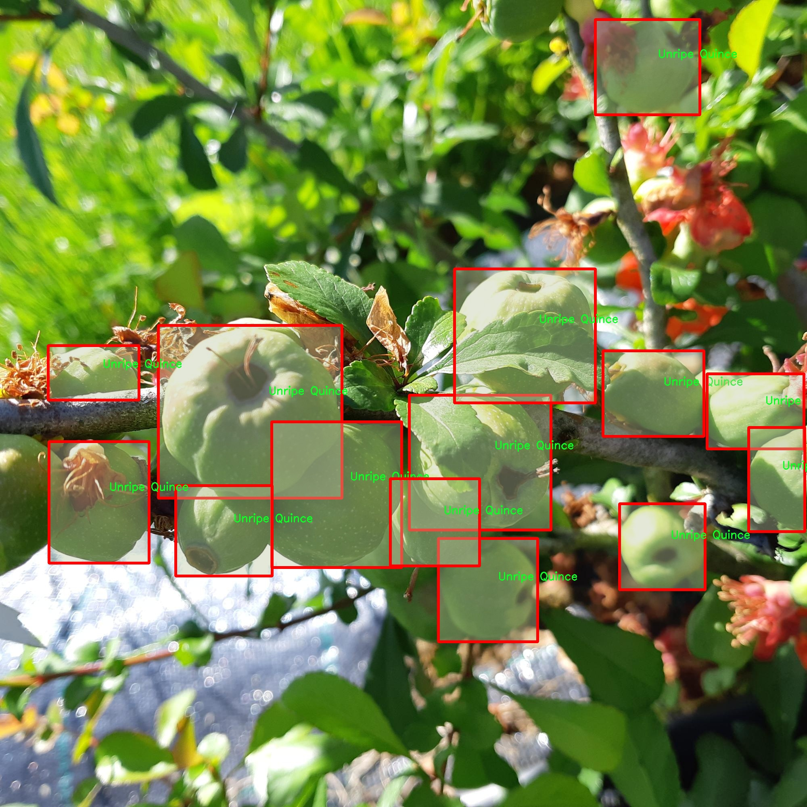
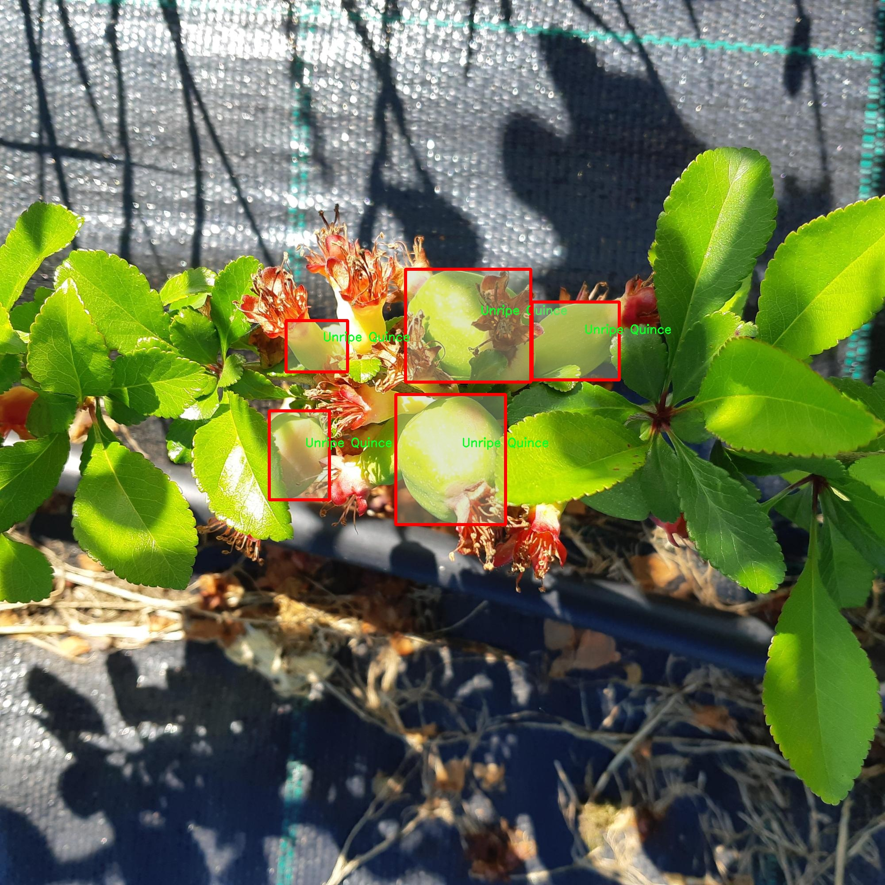
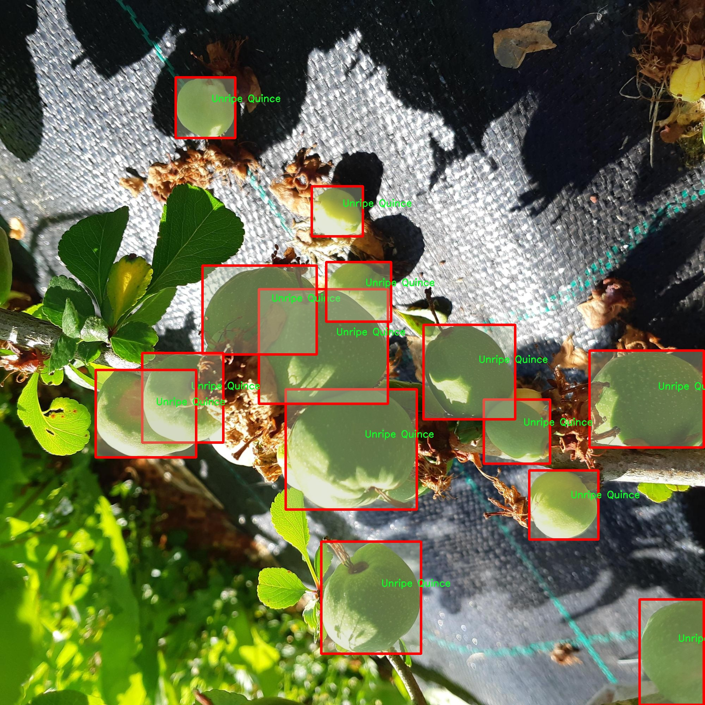

# 柿子成熟度分割系统： yolov8-seg-LSKNet

### 1.研究背景与意义

[参考博客](https://gitee.com/YOLOv8_YOLOv11_Segmentation_Studio/projects)

[博客来源](https://kdocs.cn/l/cszuIiCKVNis)

研究背景与意义

随着全球农业科技的迅速发展，计算机视觉技术在农作物的监测与管理中发挥着越来越重要的作用。尤其是在水果成熟度的检测与分割方面，传统的人工评估方法不仅耗时耗力，而且容易受到主观因素的影响，导致评估结果的不一致性。因此，开发一种高效、准确的水果成熟度分割系统显得尤为重要。柿子作为一种营养丰富、市场需求量大的水果，其成熟度的准确判断对提高果品质量、降低损耗、提升经济效益具有重要意义。

近年来，深度学习技术的飞速发展为图像处理领域带来了革命性的变化。YOLO（You Only Look Once）系列模型因其实时性和高精度而广泛应用于目标检测任务。YOLOv8作为该系列的最新版本，结合了多种先进的网络结构和算法，具有更强的特征提取能力和更高的检测精度。然而，针对特定应用场景，如柿子成熟度的分割，现有的YOLOv8模型仍需进行一定的改进，以适应特定的分类需求和环境变化。

本研究旨在基于改进的YOLOv8模型，构建一个柿子成熟度分割系统。我们将使用一个包含1500张图像的数据集，该数据集分为两类：成熟的柿子（ripe）和未成熟的柿子（unripe）。通过对该数据集的深入分析与处理，我们将为模型提供丰富的训练样本，以提高其在不同光照、背景和拍摄角度下的适应能力。此外，实例分割技术的引入将使得模型不仅能够识别柿子的存在，还能精确分割出每个柿子的轮廓，为后续的成熟度评估提供更为细致的信息。

研究的意义不仅体现在技术层面，更在于其对农业生产的深远影响。通过实现柿子成熟度的自动化检测，农民可以更为科学地安排采摘时间，避免因过早或过晚采摘导致的经济损失。同时，该系统的推广应用还将为果品的市场流通提供数据支持，帮助商家优化库存管理和销售策略，提升整体供应链的效率。

此外，本研究的成果还具有一定的推广价值。基于YOLOv8的分割系统不仅适用于柿子成熟度的检测，还可以扩展到其他水果及农作物的成熟度评估中。通过不断优化模型和数据集，我们可以为不同类型的农作物提供定制化的解决方案，推动农业智能化的发展。

综上所述，基于改进YOLOv8的柿子成熟度分割系统的研究，不仅具有重要的学术价值，更为实际农业生产提供了切实可行的技术支持。随着技术的不断进步和应用场景的拓展，我们期待该系统能够在未来的农业生产中发挥更大的作用，为实现可持续农业发展贡献力量。

### 2.图片演示







注意：本项目提供完整的训练源码数据集和训练教程,由于此博客编辑较早,暂不提供权重文件（best.pt）,需要按照6.训练教程进行训练后实现上图效果。

### 3.视频演示

[3.1 视频演示](https://www.bilibili.com/video/BV1zHUZY9E55/)

### 4.数据集信息

##### 4.1 数据集类别数＆类别名

nc: 2
names: ['Ripe Quince', 'Unripe Quince']


##### 4.2 数据集信息简介

数据集信息展示

在现代计算机视觉领域，数据集的质量和多样性直接影响到模型的训练效果和最终性能。本研究所使用的数据集名为“Quince Detection”，专门用于训练和改进YOLOv8-seg模型，以实现柿子成熟度的精确分割。该数据集的设计旨在提供一个丰富的样本库，帮助研究人员和开发者更好地理解和应用柿子成熟度分割技术。

“Quince Detection”数据集包含两个主要类别，分别是“Ripe Quince”（成熟柿子）和“Unripe Quince”（未成熟柿子）。这两个类别的划分不仅反映了柿子在生长过程中的不同阶段，也为模型提供了明确的学习目标。成熟柿子通常呈现出鲜艳的颜色和特定的外观特征，而未成熟柿子则表现出相对较暗的色调和较为坚硬的质地。这种清晰的类别划分为YOLOv8-seg模型的训练提供了良好的基础，使其能够在实际应用中准确识别和分割不同成熟度的柿子。

数据集中的样本数量丰富，涵盖了不同生长环境和光照条件下的柿子图像。这种多样性不仅提高了模型的泛化能力，也增强了其在实际应用中的适应性。通过对不同背景、角度和光照条件下的柿子进行标注，数据集为模型提供了全面的学习素材，使其能够在复杂的环境中依然保持高效的分割性能。

在数据集的构建过程中，特别注重图像的质量和标注的准确性。每一张图像都经过严格的筛选和标注，确保其在训练过程中能够为模型提供有价值的信息。标注工作由经验丰富的专家团队完成，确保每个类别的样本都能准确反映其特征。这种高质量的标注不仅提升了模型的训练效果，也为后续的评估和验证提供了可靠的依据。

此外，数据集还考虑到了不同季节和气候条件对柿子成熟度的影响，确保模型能够在各种环境下进行有效的分割。这种全面的考虑使得“Quince Detection”数据集在柿子成熟度识别领域具有较高的实用价值，能够为农业生产、果园管理等应用提供重要的技术支持。

通过使用“Quince Detection”数据集，研究人员可以充分发挥YOLOv8-seg模型的优势，推动柿子成熟度分割技术的发展。随着技术的不断进步和数据集的不断完善，未来在柿子及其他水果的成熟度识别方面，将有望实现更高的准确率和更广泛的应用场景。这不仅为农业生产提供了新的解决方案，也为相关领域的研究提供了丰富的素材和数据支持。











### 5.项目依赖环境部署教程（零基础手把手教学）

[5.1 环境部署教程链接（零基础手把手教学）](https://www.bilibili.com/video/BV1jG4Ve4E9t/?vd_source=bc9aec86d164b67a7004b996143742dc)


[5.2 安装Python虚拟环境创建和依赖库安装视频教程链接（零基础手把手教学）](https://www.bilibili.com/video/BV1nA4VeYEze/?vd_source=bc9aec86d164b67a7004b996143742dc)

### 6.手把手YOLOV8-seg训练视频教程（零基础手把手教学）

[6.1 手把手YOLOV8-seg训练视频教程（零基础小白有手就能学会）](https://www.bilibili.com/video/BV1cA4VeYETe/?vd_source=bc9aec86d164b67a7004b996143742dc)


按照上面的训练视频教程链接加载项目提供的数据集，运行train.py即可开始训练



     Epoch   gpu_mem       box       obj       cls    labels  img_size
     1/200     0G   0.01576   0.01955  0.007536        22      1280: 100%|██████████| 849/849 [14:42<00:00,  1.04s/it]
               Class     Images     Labels          P          R     mAP@.5 mAP@.5:.95: 100%|██████████| 213/213 [01:14<00:00,  2.87it/s]
                 all       3395      17314      0.994      0.957      0.0957      0.0843

     Epoch   gpu_mem       box       obj       cls    labels  img_size
     2/200     0G   0.01578   0.01923  0.007006        22      1280: 100%|██████████| 849/849 [14:44<00:00,  1.04s/it]
               Class     Images     Labels          P          R     mAP@.5 mAP@.5:.95: 100%|██████████| 213/213 [01:12<00:00,  2.95it/s]
                 all       3395      17314      0.996      0.956      0.0957      0.0845

     Epoch   gpu_mem       box       obj       cls    labels  img_size
     3/200     0G   0.01561    0.0191  0.006895        27      1280: 100%|██████████| 849/849 [10:56<00:00,  1.29it/s]
               Class     Images     Labels          P          R     mAP@.5 mAP@.5:.95: 100%|███████   | 187/213 [00:52<00:00,  4.04it/s]
                 all       3395      17314      0.996      0.957      0.0957      0.0845


### 7.50+种全套YOLOV8-seg创新点加载调参实验视频教程（一键加载写好的改进模型的配置文件）

[7.1 50+种全套YOLOV8-seg创新点加载调参实验视频教程（一键加载写好的改进模型的配置文件）](https://www.bilibili.com/video/BV1Hw4VePEXv/?vd_source=bc9aec86d164b67a7004b996143742dc)

### YOLOV8-seg算法简介

原始YOLOv8-seg算法原理

YOLOv8-seg算法是YOLO系列中的最新版本，专注于目标检测与实例分割任务。作为一种单阶段检测算法，YOLOv8在检测精度和速度上都表现出色，成为计算机视觉领域的佼佼者。该算法的设计理念是将目标检测与图像分割相结合，旨在提供更高效的解决方案，以应对日益复杂的视觉任务。

YOLOv8-seg的网络结构主要由四个部分组成：输入层、Backbone骨干网络、Neck特征融合网络和Head检测模块。输入层负责对输入图像进行预处理，包括调整图像比例、实现Mosaic增强以及瞄点计算等操作。这些预处理步骤不仅有助于提高模型的鲁棒性，还能增强模型对不同场景的适应能力。

在Backbone部分，YOLOv8采用了经过优化的DarkNet结构，并引入了C2f模块替代了传统的C3模块。C2f模块通过增加跳层连接和额外的Split操作，增强了特征提取的能力，确保了丰富的梯度流动信息得以保留。这种设计不仅提升了特征提取的效率，还保持了模型的轻量级特性，使得YOLOv8能够在资源受限的环境中运行良好。通过SPPF模块，YOLOv8对输出特征图进行处理，利用不同内核尺寸的池化操作合并特征图，进而将处理结果传递至Neck部分。

Neck部分采用了“双塔结构”，结合了特征金字塔网络（FPN）和路径聚合网络（PAN），促进了语义特征与定位特征的有效转移。这种结构的设计旨在进一步巩固网络的特征融合能力，使得模型能够获取更丰富的特征信息，从而在不同尺度目标的检测中表现出色。特征金字塔网络通过多层次的特征融合，确保了高层语义信息与低层细节信息的有效结合，提升了模型对复杂场景的理解能力。

在Head检测模块中，YOLOv8-seg引入了解耦头的结构，将回归分支和分类分支分离，显著加速了模型的收敛速度。这一创新设计使得模型在进行目标检测时，能够更加高效地处理不同类别的目标，同时提高了分割精度。YOLOv8-seg的检测模块包含三个Detect检测器，能够对输入图像中的目标进行精准定位和分类。

YOLOv8-seg的另一个重要创新是其Anchor-Free检测头的引入，摒弃了传统的Anchor-Based方法。这一转变使得模型在处理小目标和高分辨率图像时表现得更加灵活，能够适应各种复杂的视觉场景。此外，YOLOv8-seg还采用了新的损失函数，包括BCELoss作为分类损失，以及DFLLoss和CIoULoss作为回归损失，这些改进进一步提升了模型的训练效果和检测性能。

在数据增强方面，YOLOv8-seg借鉴了YOLOv5和YOLOv6的设计理念，采用了动态Task-Aligned Assigner样本分配策略，以优化训练过程。通过在训练的最后10个epoch中关闭马赛克增强，模型能够更好地适应真实场景中的目标特征，提升了检测的准确性。

YOLOv8-seg不仅在目标检测方面表现优异，还在实例分割任务中展现出强大的能力。通过对图像进行精细的分割，YOLOv8-seg能够在复杂场景中准确识别并分离不同的目标。这一特性使得YOLOv8-seg在自动驾驶、视频监控、医疗影像分析等领域具有广泛的应用前景。

综上所述，YOLOv8-seg算法通过一系列创新设计和结构优化，成功实现了目标检测与实例分割的高效结合。其在特征提取、特征融合、检测头设计以及损失函数等方面的改进，使得YOLOv8-seg在计算机视觉领域中占据了重要的地位。随着YOLOv8-seg的不断发展与完善，未来有望在更多实际应用中发挥其强大的能力，推动计算机视觉技术的进一步进步。


### 9.系统功能展示（检测对象为举例，实际内容以本项目数据集为准）

图9.1.系统支持检测结果表格显示

  图9.2.系统支持置信度和IOU阈值手动调节

  图9.3.系统支持自定义加载权重文件best.pt(需要你通过步骤5中训练获得)

  图9.4.系统支持摄像头实时识别

  图9.5.系统支持图片识别

  图9.6.系统支持视频识别

  图9.7.系统支持识别结果文件自动保存

  图9.8.系统支持Excel导出检测结果数据


### 10.50+种全套YOLOV8-seg创新点原理讲解（非科班也可以轻松写刊发刊，V11版本正在科研待更新）

#### 10.1 由于篇幅限制，每个创新点的具体原理讲解就不一一展开，具体见下列网址中的创新点对应子项目的技术原理博客网址【Blog】：


[10.1 50+种全套YOLOV8-seg创新点原理讲解链接](https://gitee.com/qunmasj/good)

#### 10.2 部分改进模块原理讲解(完整的改进原理见上图和技术博客链接)【如果此小节的图加载失败可以通过CSDN或者Github搜索该博客的标题访问原始博客，原始博客图片显示正常】
### YOLOv8简介
#### Neck模块设计
骨干网络和 Neck 的具体变化为：

第一个卷积层的 kernel 从 6x6 变成了 3x3
所有的 C3 模块换成 C2f，结构如下所示，可以发现多了更多的跳层连接和额外的 Split 操作


去掉了 Neck 模块中的 2 个卷积连接层
Backbone 中 C2f 的 block 数从 3-6-9-3 改成了 3-6-6-3
查看 N/S/M/L/X 等不同大小模型，可以发现 N/S 和 L/X 两组模型只是改了缩放系数，但是 S/M/L 等骨干网络的通道数设置不一样，没有遵循同一套缩放系数。如此设计的原因应该是同一套缩放系数下的通道设置不是最优设计，YOLOv7 网络设计时也没有遵循一套缩放系数作用于所有模型。

#### Head模块设计
Head 部分变化最大，从原先的耦合头变成了解耦头，并且从 YOLOv5 的 Anchor-Based 变成了 Anchor-Free。其结构如下所示：


可以看出，不再有之前的 objectness 分支，只有解耦的分类和回归分支，并且其回归分支使用了 Distribution Focal Loss 中提出的积分形式表示法。

#### Loss 计算
Loss 计算过程包括 2 个部分： 正负样本分配策略和 Loss 计算。 现代目标检测器大部分都会在正负样本分配策略上面做文章，典型的如 YOLOX 的 simOTA、TOOD 的 TaskAlignedAssigner 和 RTMDet 的 DynamicSoftLabelAssigner，这类 Assigner 大都是动态分配策略，而 YOLOv5 采用的依然是静态分配策略。考虑到动态分配策略的优异性，YOLOv8 算法中则直接引用了 TOOD 的 TaskAlignedAssigner。 TaskAlignedAssigner 的匹配策略简单总结为： 根据分类与回归的分数加权的分数选择正样本。

s 是标注类别对应的预测分值，u 是预测框和 gt 框的 iou，两者相乘就可以衡量对齐程度。

对于每一个 GT，对所有的预测框基于 GT 类别对应分类分数，预测框与 GT 的 IoU 的加权得到一个关联分类以及回归的对齐分数 alignment_metrics 。
对于每一个 GT，直接基于 alignment_metrics 对齐分数选取 topK 大的作为正样本
Loss 计算包括 2 个分支： 分类和回归分支，没有了之前的 objectness 分支。
分类分支依然采用 BCE Loss
回归分支需要和 Distribution Focal Loss 中提出的积分形式表示法绑定，因此使用了 Distribution Focal Loss， 同时还使用了 CIoU Loss
Loss 采用一定权重比例加权即可。
#### 训练数据增强
数据增强方面和 YOLOv5 差距不大，只不过引入了 YOLOX 中提出的最后 10 个 epoch 关闭 Mosaic 的操作。假设训练 epoch 是 500，其示意图如下所示：

### RCS-OSA的基本原理
参考该博客，RCSOSA（RCS-One-Shot Aggregation）是RCS-YOLO中提出的一种结构，我们可以将主要原理概括如下：

1. RCS（Reparameterized Convolution based on channel Shuffle）: 结合了通道混洗，通过重参数化卷积来增强网络的特征提取能力。

2. RCS模块: 在训练阶段，利用多分支结构学习丰富的特征表示；在推理阶段，通过结构化重参数化简化为单一分支，减少内存消耗。

3. OSA（One-Shot Aggregation）: 一次性聚合多个特征级联，减少网络计算负担，提高计算效率。

4. 特征级联: RCS-OSA模块通过堆叠RCS，确保特征的复用并加强不同层之间的信息流动。

#### RCS
RCS（基于通道Shuffle的重参数化卷积）是RCS-YOLO的核心组成部分，旨在训练阶段通过多分支结构学习丰富的特征信息，并在推理阶段通过简化为单分支结构来减少内存消耗，实现快速推理。此外，RCS利用通道分割和通道Shuffle操作来降低计算复杂性，同时保持通道间的信息交换，这样在推理阶段相比普通的3×3卷积可以减少一半的计算复杂度。通过结构重参数化，RCS能够在训练阶段从输入特征中学习深层表示，并在推理阶段实现快速推理，同时减少内存消耗。

#### RCS模块
RCS（基于通道Shuffle的重参数化卷积）模块中，结构在训练阶段使用多个分支，包括1x1和3x3的卷积，以及一个直接的连接（Identity），用于学习丰富的特征表示。在推理阶段，结构被重参数化成一个单一的3x3卷积，以减少计算复杂性和内存消耗，同时保持训练阶段学到的特征表达能力。这与RCS的设计理念紧密相连，即在不牺牲性能的情况下提高计算效率。


上图为大家展示了RCS的结构，分为训练阶段（a部分）和推理阶段（b部分）。在训练阶段，输入通过通道分割，一部分输入经过RepVGG块，另一部分保持不变。然后通过1x1卷积和3x3卷积处理RepVGG块的输出，与另一部分输入进行通道Shuffle和连接。在推理阶段，原来的多分支结构被简化为一个单一的3x3 RepConv块。这种设计允许在训练时学习复杂特征，在推理时减少计算复杂度。黑色边框的矩形代表特定的模块操作，渐变色的矩形代表张量的特定特征，矩形的宽度代表张量的通道数。 

#### OSA
OSA（One-Shot Aggregation）是一个关键的模块，旨在提高网络在处理密集连接时的效率。OSA模块通过表示具有多个感受野的多样化特征，并在最后的特征映射中仅聚合一次所有特征，从而克服了DenseNet中密集连接的低效率问题。

OSA模块的使用有两个主要目的：

1. 提高特征表示的多样性：OSA通过聚合具有不同感受野的特征来增加网络对于不同尺度的敏感性，这有助于提升模型对不同大小目标的检测能力。

2. 提高效率：通过在网络的最后一部分只进行一次特征聚合，OSA减少了重复的特征计算和存储需求，从而提高了网络的计算和能源效率。

在RCS-YOLO中，OSA模块被进一步与RCS（基于通道Shuffle的重参数化卷积）相结合，形成RCS-OSA模块。这种结合不仅保持了低成本的内存消耗，而且还实现了语义信息的有效提取，对于构建轻量级和大规模的对象检测器尤为重要。

下面我将为大家展示RCS-OSA（One-Shot Aggregation of RCS）的结构。


在RCS-OSA模块中，输入被分为两部分，一部分直接通过，另一部分通过堆叠的RCS模块进行处理。处理后的特征和直接通过的特征在通道混洗（Channel Shuffle）后合并。这种结构设计用于增强模型的特征提取和利用效率，是RCS-YOLO架构中的一个关键组成部分旨在通过一次性聚合来提高模型处理特征的能力，同时保持计算效率。

#### 特征级联
特征级联（feature cascade）是一种技术，通过在网络的一次性聚合（one-shot aggregate）路径上维持有限数量的特征级联来实现的。在RCS-YOLO中，特别是在RCS-OSA（RCS-Based One-Shot Aggregation）模块中，只保留了三个特征级联。

特征级联的目的是为了减轻网络计算负担并降低内存占用。这种方法可以有效地聚合不同层次的特征，提高模型的语义信息提取能力，同时避免了过度复杂化网络结构所带来的低效率和高资源消耗。

下面为大家提供的图像展示的是RCS-YOLO的整体架构，其中包括RCS-OSA模块。RCS-OSA在模型中用于堆叠RCS模块，以确保特征的复用并加强不同层之间的信息流动。图中显示的多层RCS-OSA模块的排列和组合反映了它们如何一起工作以优化特征传递和提高检测性能。


总结：RCS-YOLO主要由RCS-OSA（蓝色模块）和RepVGG（橙色模块）构成。这里的n代表堆叠RCS模块的数量。n_cls代表检测到的对象中的类别数量。图中的IDetect是从YOLOv7中借鉴过来的，表示使用二维卷积神经网络的检测层。这个架构通过堆叠的RCS模块和RepVGG模块，以及两种类型的检测层，实现了对象检测的任务。 


### 11.项目核心源码讲解（再也不用担心看不懂代码逻辑）

#### 11.1 ultralytics\models\yolo\classify\train.py

以下是经过简化和注释的核心代码部分，主要关注于分类训练器的实现和功能。

```python
# 导入必要的库
import torch
from ultralytics.data import ClassificationDataset, build_dataloader
from ultralytics.engine.trainer import BaseTrainer
from ultralytics.models import yolo
from ultralytics.nn.tasks import ClassificationModel
from ultralytics.utils import DEFAULT_CFG, LOGGER, RANK, colorstr

class ClassificationTrainer(BaseTrainer):
    """
    扩展自 BaseTrainer 类，用于基于分类模型的训练。
    """

    def __init__(self, cfg=DEFAULT_CFG, overrides=None, _callbacks=None):
        """初始化 ClassificationTrainer 对象，支持配置覆盖和回调函数。"""
        if overrides is None:
            overrides = {}
        overrides['task'] = 'classify'  # 设置任务类型为分类
        if overrides.get('imgsz') is None:
            overrides['imgsz'] = 224  # 默认图像大小
        super().__init__(cfg, overrides, _callbacks)

    def set_model_attributes(self):
        """从加载的数据集中设置 YOLO 模型的类名。"""
        self.model.names = self.data['names']

    def get_model(self, cfg=None, weights=None, verbose=True):
        """返回配置好的 PyTorch 分类模型。"""
        model = ClassificationModel(cfg, nc=self.data['nc'], verbose=verbose and RANK == -1)
        if weights:
            model.load(weights)  # 加载权重

        for m in model.modules():
            if not self.args.pretrained and hasattr(m, 'reset_parameters'):
                m.reset_parameters()  # 重置参数
            if isinstance(m, torch.nn.Dropout) and self.args.dropout:
                m.p = self.args.dropout  # 设置 dropout 概率
        for p in model.parameters():
            p.requires_grad = True  # 训练时参数需要梯度
        return model

    def build_dataset(self, img_path, mode='train'):
        """根据图像路径和模式创建 ClassificationDataset 实例。"""
        return ClassificationDataset(root=img_path, args=self.args, augment=mode == 'train', prefix=mode)

    def get_dataloader(self, dataset_path, batch_size=16, rank=0, mode='train'):
        """返回用于推理的 PyTorch DataLoader。"""
        dataset = self.build_dataset(dataset_path, mode)  # 构建数据集
        loader = build_dataloader(dataset, batch_size, self.args.workers, rank=rank)  # 构建数据加载器
        return loader

    def preprocess_batch(self, batch):
        """预处理一批图像和类标签。"""
        batch['img'] = batch['img'].to(self.device)  # 将图像移到设备上
        batch['cls'] = batch['cls'].to(self.device)  # 将类标签移到设备上
        return batch

    def get_validator(self):
        """返回 ClassificationValidator 实例用于验证。"""
        self.loss_names = ['loss']  # 定义损失名称
        return yolo.classify.ClassificationValidator(self.test_loader, self.save_dir)

    def final_eval(self):
        """评估训练后的模型并保存验证结果。"""
        for f in self.last, self.best:
            if f.exists():
                if f is self.best:
                    LOGGER.info(f'\nValidating {f}...')
                    self.metrics = self.validator(model=f)  # 验证模型
                    self.metrics.pop('fitness', None)  # 移除不需要的指标
        LOGGER.info(f"Results saved to {colorstr('bold', self.save_dir)}")  # 打印结果保存路径
```

### 代码说明
1. **导入库**：引入必要的模块和类，主要用于模型训练和数据处理。
2. **ClassificationTrainer 类**：继承自 `BaseTrainer`，用于分类任务的训练。
3. **初始化方法**：设置任务类型为分类，并定义图像大小。
4. **模型设置**：加载模型并设置其属性，包括类名和参数。
5. **数据集构建**：根据给定路径和模式（训练或测试）构建数据集。
6. **数据加载器**：创建数据加载器以便于批量处理数据。
7. **批处理预处理**：将图像和类标签移动到指定设备（如 GPU）。
8. **验证器**：获取验证器实例，用于模型验证。
9. **最终评估**：在训练结束后评估模型并保存结果。

以上是代码的核心部分及其详细注释，旨在帮助理解分类训练器的实现和功能。

这个文件是一个用于训练分类模型的Python脚本，属于Ultralytics YOLO项目的一部分。该脚本主要定义了一个名为`ClassificationTrainer`的类，该类继承自`BaseTrainer`，用于处理图像分类任务。

在初始化`ClassificationTrainer`时，可以传入配置参数和回调函数。默认情况下，图像大小设置为224像素。类中包含多个方法，分别负责模型的设置、数据集的构建、数据加载器的创建、批处理的预处理、训练进度的显示、验证器的获取、损失项的标记、绘制训练指标、最终评估模型以及绘制训练样本。

`set_model_attributes`方法用于从加载的数据集中设置YOLO模型的类名。`get_model`方法则负责返回一个配置好的PyTorch模型，支持加载预训练权重并根据需要重置模型参数。`setup_model`方法用于加载、创建或下载模型，支持从本地文件、Torchvision或Ultralytics资源中加载模型。

`build_dataset`方法创建一个`ClassificationDataset`实例，用于加载图像数据。`get_dataloader`方法返回一个PyTorch的DataLoader，用于对图像进行预处理并提供批量数据。`preprocess_batch`方法则将图像和类别标签移动到指定的设备上（如GPU）。

在训练过程中，`progress_string`方法用于格式化显示训练进度。`get_validator`方法返回一个用于验证的实例，`label_loss_items`方法用于返回带标签的训练损失项字典。`plot_metrics`方法从CSV文件中绘制训练指标，`final_eval`方法用于评估训练后的模型并保存验证结果。

最后，`plot_training_samples`方法用于绘制带有注释的训练样本，以便于可视化训练过程中的数据。这些功能共同构成了一个完整的图像分类训练流程，方便用户进行模型训练和评估。

#### 11.2 ultralytics\utils\callbacks\raytune.py

以下是代码中最核心的部分，并附上详细的中文注释：

```python
# 导入必要的库和模块
from ultralytics.utils import SETTINGS

# 尝试导入Ray和Tune库，并验证Ray Tune集成是否启用
try:
    assert SETTINGS['raytune'] is True  # 验证Ray Tune集成是否启用
    import ray
    from ray import tune
    from ray.air import session
except (ImportError, AssertionError):
    tune = None  # 如果导入失败或集成未启用，则将tune设置为None

# 定义在每个训练周期结束时调用的回调函数
def on_fit_epoch_end(trainer):
    """在每个训练周期结束时将训练指标发送到Ray Tune。"""
    if ray.tune.is_session_enabled():  # 检查Ray Tune会话是否启用
        metrics = trainer.metrics  # 获取当前训练指标
        metrics['epoch'] = trainer.epoch  # 将当前周期数添加到指标中
        session.report(metrics)  # 将指标报告给Ray Tune

# 根据是否启用Ray Tune来定义回调字典
callbacks = {
    'on_fit_epoch_end': on_fit_epoch_end,  # 将回调函数添加到字典中
} if tune else {}  # 如果tune为None，则回调字典为空
```

### 代码注释说明：
1. **导入模块**：首先导入`SETTINGS`以获取配置，随后尝试导入Ray和Tune库。
2. **集成验证**：通过`assert`语句检查Ray Tune是否被启用。如果未启用或导入失败，则将`tune`设置为`None`。
3. **回调函数**：定义`on_fit_epoch_end`函数，该函数在每个训练周期结束时被调用，用于将训练的指标发送到Ray Tune。
4. **指标报告**：在回调函数中，首先检查Ray Tune会话是否启用，然后获取当前的训练指标，并将当前周期数添加到指标中，最后通过`session.report`将这些指标报告给Ray Tune。
5. **回调字典**：根据`tune`是否为`None`来决定是否将回调函数添加到`callbacks`字典中。

这个程序文件是一个用于与Ray Tune集成的回调函数模块，主要用于在训练过程中将训练指标发送到Ray Tune，以便进行超参数调优。文件首先导入了Ultralytics库中的设置，然后尝试验证Ray Tune的集成是否启用。如果设置中raytune的值为True，则导入Ray库及其相关模块；如果未能导入或验证失败，则将tune设置为None。

在文件中定义了一个名为`on_fit_epoch_end`的函数，该函数在每个训练周期结束时被调用。它的作用是检查Ray Tune的会话是否已启用，如果启用，则从训练器中获取当前的训练指标，并将当前的周期数添加到指标中。最后，使用`session.report(metrics)`将这些指标报告给Ray Tune。

文件的最后部分定义了一个回调字典`callbacks`，如果tune不为None，则将`on_fit_epoch_end`函数添加到字典中；如果tune为None，则字典为空。这使得在使用Ray Tune时可以方便地注册回调函数，以便在训练过程中进行指标的报告和监控。整体上，这个文件的目的是为了增强模型训练的可调优性和监控能力。

#### 11.3 model.py

以下是代码中最核心的部分，并附上详细的中文注释：

```python
# -*- coding: utf-8 -*-
import cv2  # 导入OpenCV库，用于处理图像和视频
import torch  # 导入PyTorch库，用于深度学习
from ultralytics import YOLO  # 从ultralytics库中导入YOLO类，用于加载YOLO模型
from ultralytics.utils.torch_utils import select_device  # 导入选择设备的工具函数

# 根据是否有可用的GPU选择设备
device = "cuda:0" if torch.cuda.is_available() else "cpu"

# 初始化参数字典
ini_params = {
    'device': device,  # 设备类型（CPU或GPU）
    'conf': 0.3,  # 物体置信度阈值
    'iou': 0.05,  # 非极大值抑制的IOU阈值
    'classes': None,  # 类别过滤器，None表示不过滤任何类别
    'verbose': False  # 是否详细输出
}

class Web_Detector:  # 定义Web_Detector类
    def __init__(self, params=None):  # 构造函数
        self.model = None  # 初始化模型为None
        self.params = params if params else ini_params  # 使用提供的参数或默认参数

    def load_model(self, model_path):  # 加载模型的方法
        self.device = select_device(self.params['device'])  # 选择设备
        self.model = YOLO(model_path)  # 加载YOLO模型
        # 预热模型，确保模型准备好进行推理
        self.model(torch.zeros(1, 3, 640, 640).to(self.device).type_as(next(self.model.model.parameters())))

    def predict(self, img):  # 预测方法
        results = self.model(img, **ini_params)  # 使用YOLO模型进行预测
        return results  # 返回预测结果

    def postprocess(self, pred):  # 后处理方法
        results = []  # 初始化结果列表
        for res in pred[0].boxes:  # 遍历预测结果中的每个边界框
            class_id = int(res.cls.cpu())  # 获取类别ID
            bbox = res.xyxy.cpu().squeeze().tolist()  # 获取边界框坐标
            bbox = [int(coord) for coord in bbox]  # 转换为整数

            result = {
                "class_name": self.model.names[class_id],  # 类别名称
                "bbox": bbox,  # 边界框
                "score": res.conf.cpu().squeeze().item(),  # 置信度
                "class_id": class_id  # 类别ID
            }
            results.append(result)  # 将结果添加到列表
        return results  # 返回结果列表
```

### 代码说明：
1. **设备选择**：根据是否有可用的GPU选择计算设备，优先使用GPU。
2. **参数初始化**：定义了一些参数，如置信度阈值和IOU阈值，这些参数在模型推理时会用到。
3. **Web_Detector类**：这是一个核心类，负责加载YOLO模型、进行预测和后处理。
   - `__init__`方法：初始化模型和参数。
   - `load_model`方法：加载YOLO模型并进行预热，以确保模型可以正常工作。
   - `predict`方法：接收输入图像并调用YOLO模型进行预测。
   - `postprocess`方法：处理模型的输出，提取类别名称、边界框和置信度，并将结果整理成易于使用的格式。

这个程序文件 `model.py` 是一个用于图像检测的 Python 脚本，主要利用了 YOLO（You Only Look Once）模型进行物体检测。程序中导入了多个库和模块，包括 OpenCV、PyTorch、QtFusion 和 ultralytics 等，这些库为图像处理和深度学习提供了必要的功能。

首先，程序通过判断是否有可用的 GPU，来设置设备类型为 `cuda:0` 或 `cpu`。接着，定义了一些初始化参数，包括物体置信度阈值、IOU 阈值、类别过滤器等。这些参数在后续的模型加载和预测过程中会被使用。

接下来，定义了一个 `count_classes` 函数，用于统计检测结果中每个类别的数量。该函数接收检测信息和类别名称列表，返回一个包含每个类别计数的列表。它通过遍历检测信息，更新每个类别的计数，并最终返回一个与类别名称顺序一致的计数列表。

然后，定义了一个名为 `Web_Detector` 的类，继承自 `Detector` 抽象基类。该类的构造函数初始化了一些属性，包括模型、图像和类别名称等。它还提供了一个 `load_model` 方法，用于加载 YOLO 模型。该方法根据模型路径判断任务类型（分割或检测），并将模型加载到指定设备上。同时，它还会将模型中的类别名称转换为中文，并进行一次预热，以确保模型能够正常工作。

`preprocess` 方法用于对输入图像进行预处理，简单地将原始图像保存并返回。`predict` 方法则使用加载的模型对输入图像进行预测，返回检测结果。

在 `postprocess` 方法中，对预测结果进行后处理。该方法遍历预测结果中的每个边界框，提取类别 ID、边界框坐标、置信度等信息，并将这些信息组织成字典形式，最终返回一个包含所有检测结果的列表。

最后，`set_param` 方法允许更新检测器的参数，通过将新的参数合并到现有参数中来实现。

整体来看，这个程序文件实现了一个完整的物体检测流程，包括模型加载、图像预处理、预测和结果后处理，适用于需要进行实时或批量图像检测的应用场景。

#### 11.4 ultralytics\trackers\bot_sort.py

以下是经过简化和注释的核心代码部分，主要保留了 `BOTrack` 和 `BOTSORT` 类的核心功能及其重要方法。

```python
# Ultralytics YOLO 🚀, AGPL-3.0 license

from collections import deque
import numpy as np
from .basetrack import TrackState
from .byte_tracker import BYTETracker
from .utils import matching
from .utils.gmc import GMC
from .utils.kalman_filter import KalmanFilterXYWH

class BOTrack:
    """
    BOTrack类用于对象跟踪，扩展了基本的STrack类，添加了特征平滑和卡尔曼滤波功能。
    """

    shared_kalman = KalmanFilterXYWH()  # 共享的卡尔曼滤波器实例

    def __init__(self, tlwh, score, cls, feat=None, feat_history=50):
        """
        初始化BOTrack实例，设置跟踪框参数和特征历史记录。
        :param tlwh: 跟踪框的左上角坐标和宽高
        :param score: 检测分数
        :param cls: 类别
        :param feat: 特征向量
        :param feat_history: 特征历史记录的最大长度
        """
        self.smooth_feat = None  # 平滑后的特征
        self.curr_feat = None  # 当前特征
        if feat is not None:
            self.update_features(feat)  # 更新特征
        self.features = deque([], maxlen=feat_history)  # 存储特征的双端队列
        self.alpha = 0.9  # 平滑因子

    def update_features(self, feat):
        """
        更新特征向量，并使用指数移动平均进行平滑。
        :param feat: 新的特征向量
        """
        feat /= np.linalg.norm(feat)  # 归一化特征
        self.curr_feat = feat
        if self.smooth_feat is None:
            self.smooth_feat = feat  # 如果没有平滑特征，则直接赋值
        else:
            # 使用指数移动平均更新平滑特征
            self.smooth_feat = self.alpha * self.smooth_feat + (1 - self.alpha) * feat
        self.features.append(feat)  # 将新特征添加到历史记录中
        self.smooth_feat /= np.linalg.norm(self.smooth_feat)  # 归一化平滑特征

    def predict(self):
        """
        使用卡尔曼滤波器预测状态的均值和协方差。
        """
        mean_state = self.mean.copy()  # 复制当前均值状态
        if self.state != TrackState.Tracked:
            mean_state[6] = 0  # 如果状态不是跟踪状态，重置速度
            mean_state[7] = 0

        # 进行卡尔曼预测
        self.mean, self.covariance = self.shared_kalman.predict(mean_state, self.covariance)

    @property
    def tlwh(self):
        """
        获取当前跟踪框的位置，格式为 (左上角x, 左上角y, 宽, 高)。
        """
        if self.mean is None:
            return self._tlwh.copy()  # 如果均值为空，返回原始tlwh
        ret = self.mean[:4].copy()  # 复制均值的前四个元素
        ret[:2] -= ret[2:] / 2  # 计算左上角坐标
        return ret

class BOTSORT(BYTETracker):
    """
    BOTSORT类用于YOLOv8的对象跟踪，结合了ReID和GMC算法。
    """

    def __init__(self, args, frame_rate=30):
        """
        初始化BOTSORT实例，设置跟踪参数。
        :param args: 命令行参数
        :param frame_rate: 帧率
        """
        super().__init__(args, frame_rate)
        self.proximity_thresh = args.proximity_thresh  # 跟踪之间的空间接近阈值
        self.appearance_thresh = args.appearance_thresh  # 外观相似性阈值
        self.gmc = GMC(method=args.gmc_method)  # 初始化GMC算法

    def init_track(self, dets, scores, cls, img=None):
        """
        初始化跟踪，使用检测结果、分数和类别。
        :param dets: 检测框
        :param scores: 检测分数
        :param cls: 类别
        :param img: 图像（可选）
        :return: 跟踪对象列表
        """
        if len(dets) == 0:
            return []
        return [BOTrack(xyxy, s, c) for (xyxy, s, c) in zip(dets, scores, cls)]  # 返回BOTrack实例列表

    def get_dists(self, tracks, detections):
        """
        计算跟踪和检测之间的距离。
        :param tracks: 当前跟踪对象
        :param detections: 当前检测结果
        :return: 距离矩阵
        """
        dists = matching.iou_distance(tracks, detections)  # 计算IoU距离
        # 进一步处理距离矩阵（如使用ReID嵌入等）
        return dists

    def multi_predict(self, tracks):
        """
        预测多个对象的状态。
        :param tracks: 当前跟踪对象列表
        """
        BOTrack.multi_predict(tracks)  # 调用BOTrack的多目标预测方法
```

### 代码说明
1. **BOTrack类**：负责单个对象的跟踪，使用卡尔曼滤波器进行状态预测，并通过特征平滑来提高跟踪的稳定性。
2. **BOTSORT类**：扩展了BYTETracker，结合了ReID和GMC算法，用于处理多个对象的跟踪。
3. **特征更新**：通过指数移动平均平滑特征向量，增强跟踪的鲁棒性。
4. **预测功能**：使用卡尔曼滤波器预测对象的未来状态，适应动态场景。
5. **距离计算**：根据IoU和可选的ReID嵌入计算跟踪与检测之间的距离，以便进行数据关联。

这个程序文件是用于实现YOLOv8目标检测模型中的一种跟踪算法，名为BOTSORT。该算法结合了ReID（重识别）和GMC（图形模型组合）算法，以提高目标跟踪的准确性和鲁棒性。

文件中定义了两个主要的类：`BOTrack`和`BOTSORT`。`BOTrack`类是对YOLOv8中STrack类的扩展，增加了对象跟踪的功能。它包含了一些重要的属性和方法。属性方面，`shared_kalman`是一个共享的卡尔曼滤波器实例，用于所有BOTrack实例的状态预测。`smooth_feat`和`curr_feat`分别表示平滑后的特征向量和当前特征向量，`features`是一个双端队列，用于存储特征向量，最大长度由`feat_history`决定。`alpha`是特征平滑的因子，`mean`和`covariance`分别表示卡尔曼滤波器的均值状态和协方差矩阵。

在方法方面，`update_features`用于更新特征向量并使用指数移动平均进行平滑，`predict`方法则使用卡尔曼滤波器进行状态预测。`re_activate`和`update`方法用于重新激活跟踪和更新YOLOv8实例，`tlwh`属性用于获取当前的边界框位置，`multi_predict`方法用于预测多个对象的状态，`convert_coords`和`tlwh_to_xywh`方法用于坐标格式转换。

`BOTSORT`类是对BYTETracker类的扩展，专门为YOLOv8设计，旨在实现带有ReID和GMC算法的目标跟踪。它的属性包括空间接近度阈值、外观相似度阈值、ReID嵌入处理对象以及GMC实例。方法方面，`get_kalmanfilter`返回卡尔曼滤波器的实例，`init_track`用于初始化跟踪，`get_dists`计算跟踪和检测之间的距离，`multi_predict`则用于对多个对象进行预测和跟踪。

总体来说，这个文件实现了一个复杂的目标跟踪系统，结合了多种技术以提高跟踪的准确性和效率，适用于YOLOv8模型的应用场景。

#### 11.5 utils.py

以下是经过简化和注释的核心代码部分：

```python
import os
import cv2
import pandas as pd
import streamlit as st
from PIL import Image
from QtFusion.path import abs_path

def save_uploaded_file(uploaded_file):
    """
    保存上传的文件到服务器上。

    Args:
        uploaded_file (UploadedFile): 通过Streamlit上传的文件。

    Returns:
        str: 保存文件的完整路径，如果没有文件上传则返回 None。
    """
    # 检查是否有文件上传
    if uploaded_file is not None:
        base_path = "tempDir"  # 定义文件保存的基本路径

        # 如果路径不存在，创建这个路径
        if not os.path.exists(base_path):
            os.makedirs(base_path)
        
        # 获取文件的完整路径
        file_path = os.path.join(base_path, uploaded_file.name)

        # 以二进制写模式打开文件并写入
        with open(file_path, "wb") as f:
            f.write(uploaded_file.getbuffer())  # 将上传的文件内容写入到指定路径

        return file_path  # 返回文件路径

    return None  # 如果没有文件上传，返回 None


def concat_results(result, location, confidence, time):
    """
    显示检测结果。

    Args:
        result (str): 检测结果。
        location (str): 检测位置。
        confidence (str): 置信度。
        time (str): 检测用时。

    Returns:
        DataFrame: 包含检测结果的 DataFrame。
    """
    # 创建一个包含检测信息的字典
    result_data = {
        "识别结果": [result],
        "位置": [location],
        "置信度": [confidence],
        "用时": [time]
    }

    # 将字典转换为 DataFrame
    results_df = pd.DataFrame(result_data)
    return results_df


def get_camera_names():
    """
    获取可用摄像头名称列表。

    Returns:
        list: 返回包含“未启用摄像头”和可用摄像头索引号的列表。
    """
    camera_names = ["摄像头检测关闭", "0"]  # 初始化摄像头名称列表
    max_test_cameras = 10  # 定义要测试的最大摄像头数量

    # 测试可用的摄像头
    for i in range(max_test_cameras):
        cap = cv2.VideoCapture(i, cv2.CAP_DSHOW)  # 尝试打开摄像头
        if cap.isOpened() and str(i) not in camera_names:  # 如果摄像头打开成功
            camera_names.append(str(i))  # 添加摄像头索引到列表
            cap.release()  # 释放摄像头资源
    
    # 如果没有找到可用的摄像头，输出提示信息
    if len(camera_names) == 1:
        st.write("未找到可用的摄像头")
    
    return camera_names  # 返回摄像头名称列表
```

### 代码核心部分说明：
1. **保存上传文件**：`save_uploaded_file` 函数负责将用户上传的文件保存到服务器的指定目录中，并返回文件的完整路径。
2. **显示检测结果**：`concat_results` 函数将检测结果、位置、置信度和用时信息整合成一个 DataFrame，方便后续展示和处理。
3. **获取摄像头名称**：`get_camera_names` 函数通过尝试打开多个摄像头，获取可用摄像头的索引，并返回一个列表。

这个程序文件 `utils.py` 主要包含了一些实用的函数，用于处理文件上传、显示检测结果、加载默认图片以及获取可用摄像头的名称。首先，导入了一些必要的库，包括操作系统相关的 `os`、图像处理库 `cv2`、数据处理库 `pandas`、Streamlit 库 `st` 以及用于处理图像的 `PIL` 库中的 `Image`。此外，还导入了一个自定义模块 `abs_path` 用于获取文件的绝对路径。

文件中定义的第一个函数是 `save_uploaded_file`，它的作用是将用户通过 Streamlit 上传的文件保存到服务器的指定目录中。函数首先检查是否有文件被上传，如果有，则定义一个基本路径 `tempDir` 用于存储文件。如果该路径不存在，函数会创建这个路径。接着，函数会构建文件的完整路径，并以二进制写模式打开文件，将上传的内容写入到指定路径中。最后，函数返回保存文件的完整路径，如果没有文件上传，则返回 `None`。

接下来是 `concat_results` 函数，它用于显示检测结果。该函数接收四个参数：检测结果、检测位置、置信度和检测用时。函数内部创建了一个包含这些信息的字典，并利用 `pandas` 创建一个 DataFrame，最后返回这个 DataFrame，以便后续展示。

第三个函数是 `load_default_image`，它的功能是加载一个默认的图片。函数通过调用 `abs_path` 获取默认图片的绝对路径，然后使用 `Image.open` 打开这个图片并返回其对象。

最后一个函数是 `get_camera_names`，用于获取可用摄像头的名称列表。函数首先定义一个包含“未启用摄像头”和索引“0”的列表。然后，设置一个最大测试摄像头数量的上限（默认为10），并通过循环尝试打开每个索引的摄像头。如果成功打开，则将该索引添加到摄像头名称列表中，并释放摄像头资源。如果没有找到可用的摄像头，函数会在 Streamlit 界面上显示一条消息。最终，函数返回包含所有可用摄像头名称的列表。

整体来看，这个文件提供了一些基础的功能，方便在使用 Streamlit 构建应用时处理文件上传、显示结果和获取摄像头信息。

### 12.系统整体结构（节选）

### 程序整体功能和构架概括

该程序主要是一个基于YOLO（You Only Look Once）模型的计算机视觉应用，涵盖了图像分类、目标检测和跟踪等功能。程序的架构由多个模块组成，每个模块负责特定的功能，以实现整体的图像处理和分析流程。以下是各个模块的主要功能：

1. **训练模块** (`train.py`): 负责图像分类模型的训练，包括模型的设置、数据加载、训练过程监控和评估。
2. **回调模块** (`raytune.py`): 提供与Ray Tune集成的功能，用于在训练过程中报告指标，以便进行超参数调优。
3. **模型模块** (`model.py`): 实现YOLO模型的加载、图像预处理、预测和结果后处理，主要用于目标检测。
4. **跟踪模块** (`bot_sort.py`): 实现BOTSORT目标跟踪算法，结合ReID和GMC技术，以提高目标跟踪的准确性和鲁棒性。
5. **工具模块** (`utils.py`): 提供一些实用的功能，如文件上传、结果显示、默认图片加载和摄像头信息获取。

### 文件功能整理表

| 文件路径                                          | 功能描述                                                                                       |
|--------------------------------------------------|-----------------------------------------------------------------------------------------------|
| `ultralytics/models/yolo/classify/train.py`     | 负责图像分类模型的训练，包括模型设置、数据加载、训练过程监控和评估。                       |
| `ultralytics/utils/callbacks/raytune.py`       | 提供与Ray Tune集成的回调函数，用于在训练过程中报告指标，以便进行超参数调优。               |
| `model.py`                                       | 实现YOLO模型的加载、图像预处理、预测和结果后处理，主要用于目标检测。                       |
| `ultralytics/trackers/bot_sort.py`              | 实现BOTSORT目标跟踪算法，结合ReID和GMC技术，提高目标跟踪的准确性和鲁棒性。               |
| `utils.py`                                       | 提供文件上传、结果显示、默认图片加载和摄像头信息获取等实用功能。                           |

这个结构使得程序在处理图像分类、目标检测和跟踪任务时具有良好的模块化和可扩展性，便于后续的维护和功能扩展。

### 13.图片、视频、摄像头图像分割Demo(去除WebUI)代码

在这个博客小节中，我们将讨论如何在不使用WebUI的情况下，实现图像分割模型的使用。本项目代码已经优化整合，方便用户将分割功能嵌入自己的项目中。
核心功能包括图片、视频、摄像头图像的分割，ROI区域的轮廓提取、类别分类、周长计算、面积计算、圆度计算以及颜色提取等。
这些功能提供了良好的二次开发基础。

### 核心代码解读

以下是主要代码片段，我们会为每一块代码进行详细的批注解释：

```python
import random
import cv2
import numpy as np
from PIL import ImageFont, ImageDraw, Image
from hashlib import md5
from model import Web_Detector
from chinese_name_list import Label_list

# 根据名称生成颜色
def generate_color_based_on_name(name):
    ......

# 计算多边形面积
def calculate_polygon_area(points):
    return cv2.contourArea(points.astype(np.float32))

...
# 绘制中文标签
def draw_with_chinese(image, text, position, font_size=20, color=(255, 0, 0)):
    image_pil = Image.fromarray(cv2.cvtColor(image, cv2.COLOR_BGR2RGB))
    draw = ImageDraw.Draw(image_pil)
    font = ImageFont.truetype("simsun.ttc", font_size, encoding="unic")
    draw.text(position, text, font=font, fill=color)
    return cv2.cvtColor(np.array(image_pil), cv2.COLOR_RGB2BGR)

# 动态调整参数
def adjust_parameter(image_size, base_size=1000):
    max_size = max(image_size)
    return max_size / base_size

# 绘制检测结果
def draw_detections(image, info, alpha=0.2):
    name, bbox, conf, cls_id, mask = info['class_name'], info['bbox'], info['score'], info['class_id'], info['mask']
    adjust_param = adjust_parameter(image.shape[:2])
    spacing = int(20 * adjust_param)

    if mask is None:
        x1, y1, x2, y2 = bbox
        aim_frame_area = (x2 - x1) * (y2 - y1)
        cv2.rectangle(image, (x1, y1), (x2, y2), color=(0, 0, 255), thickness=int(3 * adjust_param))
        image = draw_with_chinese(image, name, (x1, y1 - int(30 * adjust_param)), font_size=int(35 * adjust_param))
        y_offset = int(50 * adjust_param)  # 类别名称上方绘制，其下方留出空间
    else:
        mask_points = np.concatenate(mask)
        aim_frame_area = calculate_polygon_area(mask_points)
        mask_color = generate_color_based_on_name(name)
        try:
            overlay = image.copy()
            cv2.fillPoly(overlay, [mask_points.astype(np.int32)], mask_color)
            image = cv2.addWeighted(overlay, 0.3, image, 0.7, 0)
            cv2.drawContours(image, [mask_points.astype(np.int32)], -1, (0, 0, 255), thickness=int(8 * adjust_param))

            # 计算面积、周长、圆度
            area = cv2.contourArea(mask_points.astype(np.int32))
            perimeter = cv2.arcLength(mask_points.astype(np.int32), True)
            ......

            # 计算色彩
            mask = np.zeros(image.shape[:2], dtype=np.uint8)
            cv2.drawContours(mask, [mask_points.astype(np.int32)], -1, 255, -1)
            color_points = cv2.findNonZero(mask)
            ......

            # 绘制类别名称
            x, y = np.min(mask_points, axis=0).astype(int)
            image = draw_with_chinese(image, name, (x, y - int(30 * adjust_param)), font_size=int(35 * adjust_param))
            y_offset = int(50 * adjust_param)

            # 绘制面积、周长、圆度和色彩值
            metrics = [("Area", area), ("Perimeter", perimeter), ("Circularity", circularity), ("Color", color_str)]
            for idx, (metric_name, metric_value) in enumerate(metrics):
                ......

    return image, aim_frame_area

# 处理每帧图像
def process_frame(model, image):
    pre_img = model.preprocess(image)
    pred = model.predict(pre_img)
    det = pred[0] if det is not None and len(det)
    if det:
        det_info = model.postprocess(pred)
        for info in det_info:
            image, _ = draw_detections(image, info)
    return image

if __name__ == "__main__":
    cls_name = Label_list
    model = Web_Detector()
    model.load_model("./weights/yolov8s-seg.pt")

    # 摄像头实时处理
    cap = cv2.VideoCapture(0)
    while cap.isOpened():
        ret, frame = cap.read()
        if not ret:
            break
        ......

    # 图片处理
    image_path = './icon/OIP.jpg'
    image = cv2.imread(image_path)
    if image is not None:
        processed_image = process_frame(model, image)
        ......

    # 视频处理
    video_path = ''  # 输入视频的路径
    cap = cv2.VideoCapture(video_path)
    while cap.isOpened():
        ret, frame = cap.read()
        ......
```


### 14.完整训练+Web前端界面+50+种创新点源码、数据集获取


# [下载链接：https://mbd.pub/o/bread/Z5eclZ1s](https://mbd.pub/o/bread/Z5eclZ1s)